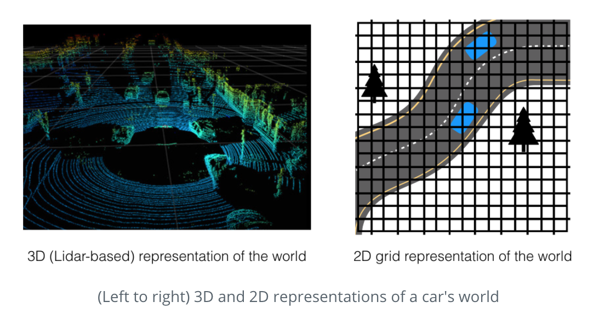
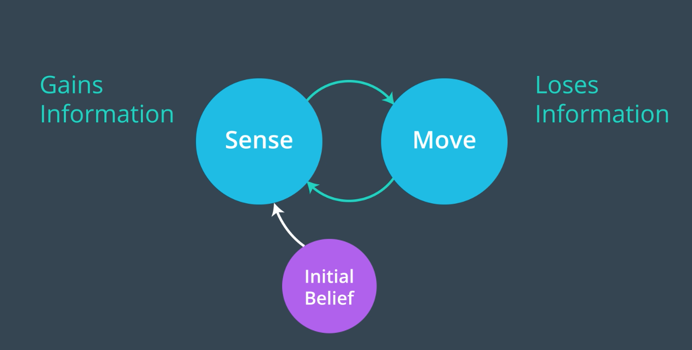

# 1D-Localization
1D localization using Bayesian Filter to locate a robot in 1D space and represent uncertainty in robot motion

## The goal
A robot perceives the world through its "senses." For example, self-driving cars use video, radar, and Lidar, to observe the world around them. As cars gather data, they build up a 3D world of observations that tells the car where it is, where other objects (like trees, pedestrians, and other vehicles) are, and where it should be going!

To start from basic localization, the goal is to apply one-dimensional representation of the world for simplicity to solve more complex robot localization in 3D later. 

## Steps
There are 9 steps to finish 1 dimensional robot localization logic. 
1. [Intro to 1D robot world](1.%201D%20Robot%20World.ipynb)
2. [Probability after Sense](2.%20Probability%20After%20Sense.ipynb)
3. [Sense Function](3.%20Sense%20Function.ipynb)
4. [Normalization](4.%20Normalized%20Sense%20Function.ipynb)
5. [Multiple Measurements](5.%20Multiple%20Measurements.ipynb)
6. [Move Functions](6.%20Move%20Function.ipynb)
7. [Uncerstainty](7.%20Inexact%20Move%20Function.ipynb)
8. [Multiple Movements](8.%20Multiple%20Movements.ipynb)
9. [Sense and Move](9.%20Sense%20and%20Move.ipynb)

A robot senses the world through cameras and other sensors, but these sensors are not perfectly accurate. To begine with, we assume a robot in a 1D world made of colored grid cells; all cells were either green or red. A robot starts out without any information about where it is in a 1D world and localizes itself from an initial, uniform distribution to sensing and updating that distribution.

In the robot world, the grid cell representations of the environment are known as discrete representations. Discrete just means a limited number of places a robot can be (ex. in one grid cell). That's because robots, and autonomous vehicles like self-driving cars, use maps to figure out where they are, and maps lend themselves to being divided up into grids and sections.

Also there are continuous probability distributions when locating objects that are moving around the robot to represent uncertainty. Continuous means that these objects can be anywhere around the robot and their movement is smooth.

In the last step, during Sense and Move Cycle, each time a robot senses (in this case a red or green color)it gains information about its environment, and everytime it moves, it loses some information due to motion uncertainty.

## Lessons Learned 
First, a robot starts out with some certainty/uncertainty about its position in a world, which is represented by an initial probability distribution, often called the initial belief or the prior. Then it cycles through sensor measurements and movements; Sense and Move cyclle. 

1. When a robot senses, a measurement update happens; this is a simple multiplication that is based off of Bayes' rule, which says that we can update our belief based on measurements. This step was also followed by a normalization to make sure that the result distribution was still vald (and added up to 1).
2. When it moves, a motion update or prediction step occurs; this step is a convolution that shifts the distribution in the direction of motion.
